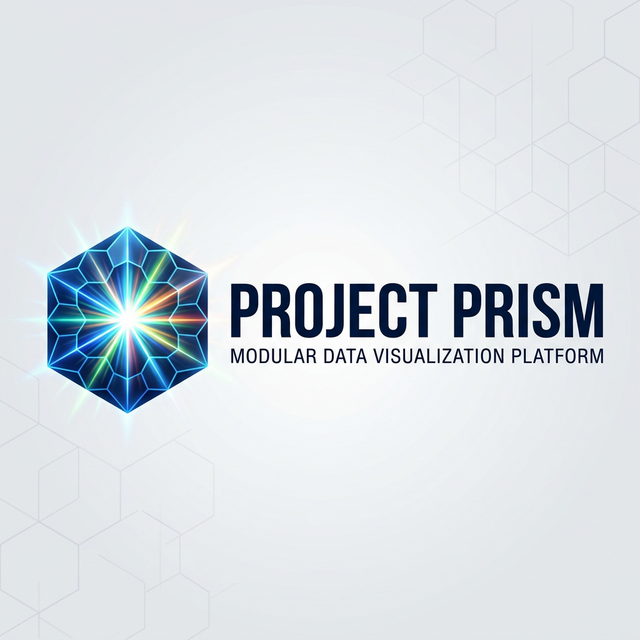

  

# Modular Dashboard Platform (MDP)

Enterprise-grade, containerized dashboard system with real-time capabilities, multi-database support, and comprehensive RBAC.

## Quick Start

### Prerequisites
- Docker 24.0+
- Node.js 20+
- Python 3.11+ (for connector service)
- VS Code with recommended extensions

### 1. Clone and Setup
